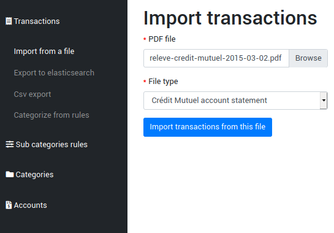
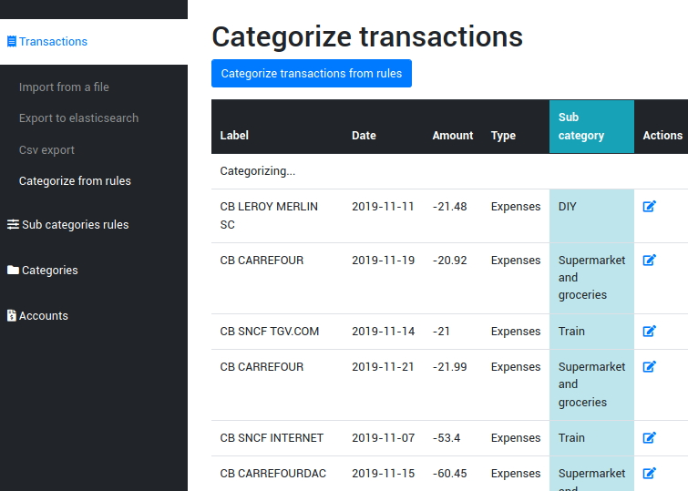
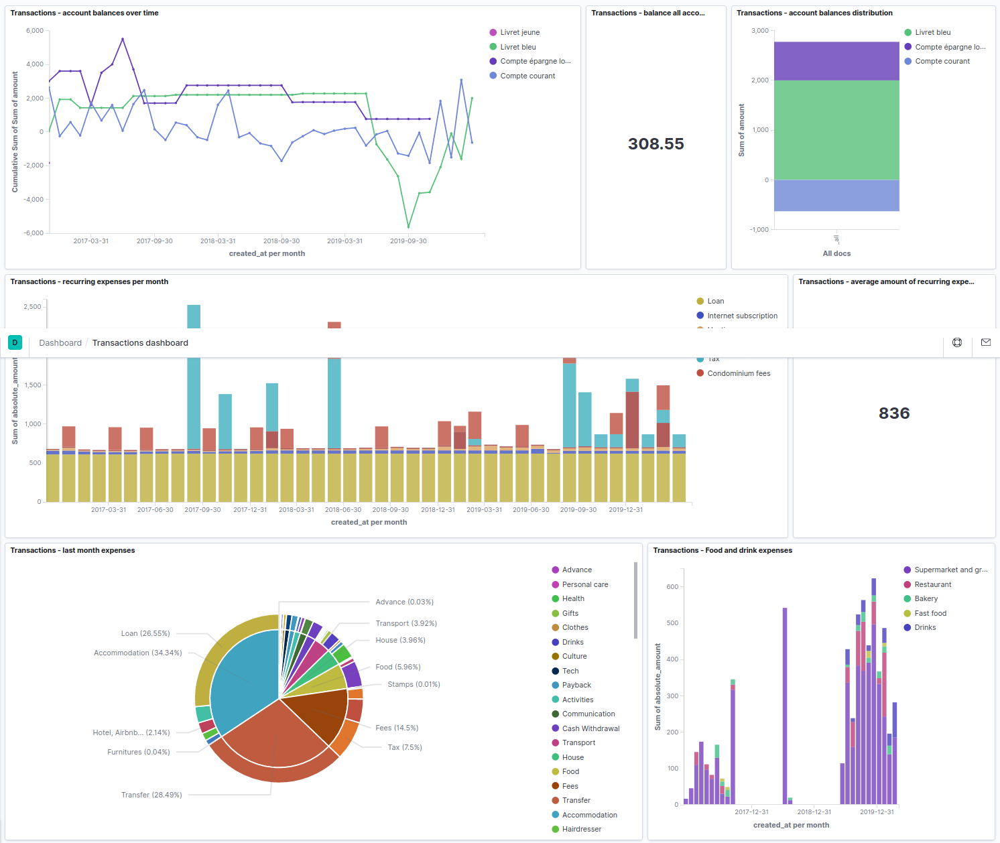

Expenses categorizer
====================

An application written in PHP (Symfony 4 framework) used to import, categorize and analyze transactions.

Core values
-----------

* Being able to categorize transactions from a monthly account statement in seconds, not minutes (obviously initial setup will take longer).
* Build every chart one can think of to make sense of expenses and revenues.

Workflow
--------

1. Import transactions from files (this application + third party parsers to plug in)




2. Categorize transactions (this application). Create some rules that will categorize most of your transactions automatically.




3. Export and analyze your expenses and revenues. (no need to reinvent the wheel : elasticsearch & kibana are perfect for this)



Installation
------------

Run the app:

```bash
docker-compose up -d mysql
docker-compose logs -f mysql # wait for mysql to be ready
docker-compose up -d # doctrine migrations will run as soon as the php container get started

# optionally, create some default transaction categories
docker-compose run php php bin/console doctrine:fixtures:load --append
```

Run the tests:

```bash
docker-compose run php php bin/phpunit
```

Create new parsers
------------------

The current implementation can import transactions from account statements coming from the following banks:
 * Crédit Mutuel (parser service here)
 * Caisse d'épargne

Source code for these parsers can be found at https://github.com/Ovski4/account-statement-parsers.

To add a new file parser, create a new class that implements **AbstractFileParser**. The symfony framework will take care of creating tagged services automatically and update the user interface (the forms) accordingly.

You will have to implement the following methods:
 * parse() : returns an array of [Transactions objects](src/Entity/Transaction.php).
 * getName() : returns a string that will appear in urls
 * getLabel() : returns a string that will be used in forms and alerts (a human readable string).

Here is an example below:

```php
<?php

namespace App\Services\FileParser;

use Symfony\Component\HttpClient\HttpClient;
use App\Entity\Transaction;

class HelloBankAccountStatementParser extends AbstractFileParser 
{
    private $accountRepository;

    public function __construct(AccountRepository $accountRepository)
    {
        $this->accountRepository = $accountRepository;
    }

    public function getName(): string
    {
        return 'hello-bank';
    }

    public function getLabel(): string
    {
        return 'Hello Bank account statement';
    }

    public function parse(string $filepath): array
    {
        $results = ... // do your magic here with the file

        $transactions = [];

        foreach($results as $result) {
            
            $transaction = new Transaction();
            $transaction
                ->setAmount($result['value'])
                ->setCreatedAt(
                    (\DateTime::createFromFormat('d/m/Y', $result['date']))->setTime(0, 0, 0)
                )
                ->setLabel($result['label'])
                ->setAccount($this->accountRepository->findByAliasOrName($result['account']))
            ;

            $transactions[] = $transaction;

        }

        return $transactions;
    }
}

```
