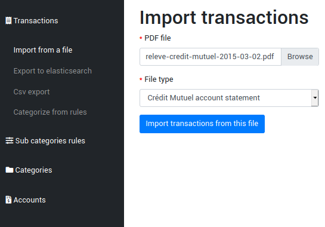
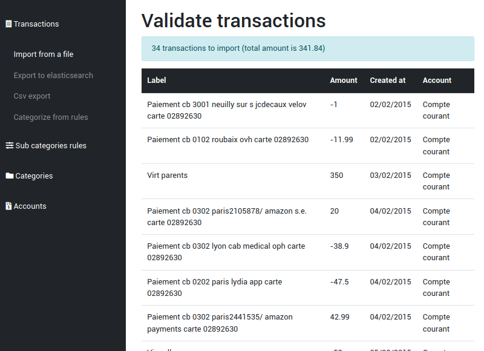
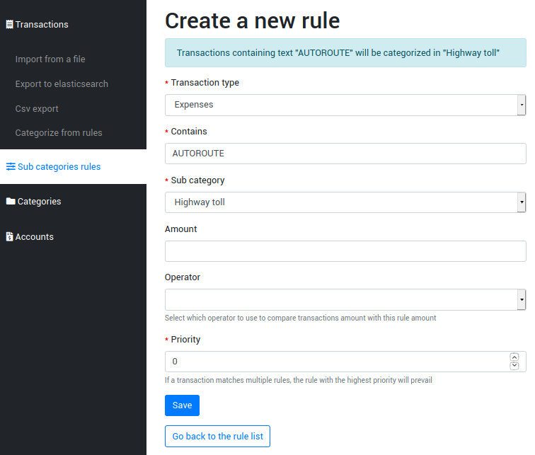
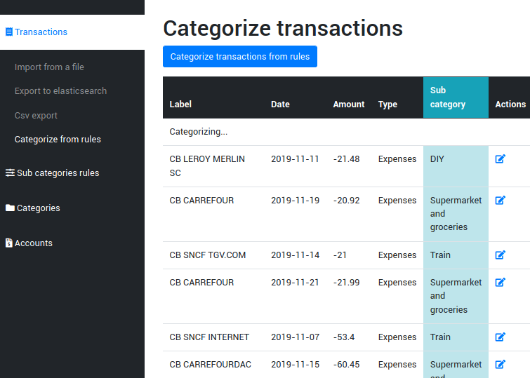

Workflow
--------

1. Import transactions from files (this application + third party parsers to plug in)

2. Categorize transactions (this application). Create some rules that will categorize most of your transactions automatically.

3. Export and analyze your expenses and revenues. (no need to reinvent the wheel : elasticsearch & kibana are perfect for this)

